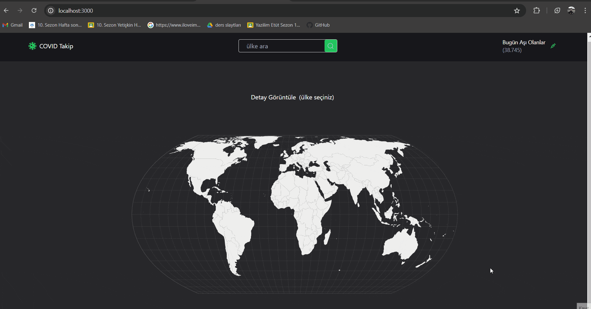

# COVID Map Application

## Overview

This React-based application provides real-time tracking of COVID-19 cases globally. It features an interactive map, daily updates, and statistical analysis to help users stay informed about the pandemic.

## Features

- Interactive world map displaying COVID-19 case data.
- Daily updated statistics of total cases, recoveries, and deaths.
- Country-specific data visualization.
- Responsive design for desktop and mobile devices.

## Libraries

- react-router-dom
- react-icons
- tailwind
- react-simple-maps
- @reduxjs/toolkit
- react-redux
- @testing-library/user-event@14.0
- axios@^0.27.2
- react-testing-library
- jest
- thunk

## Project GIF

## API

- (COVID Data): https://rapidapi.com/axisbits-axisbits-default/api/covid-19-statistics

- (Country Data): https://restcountries.com/
